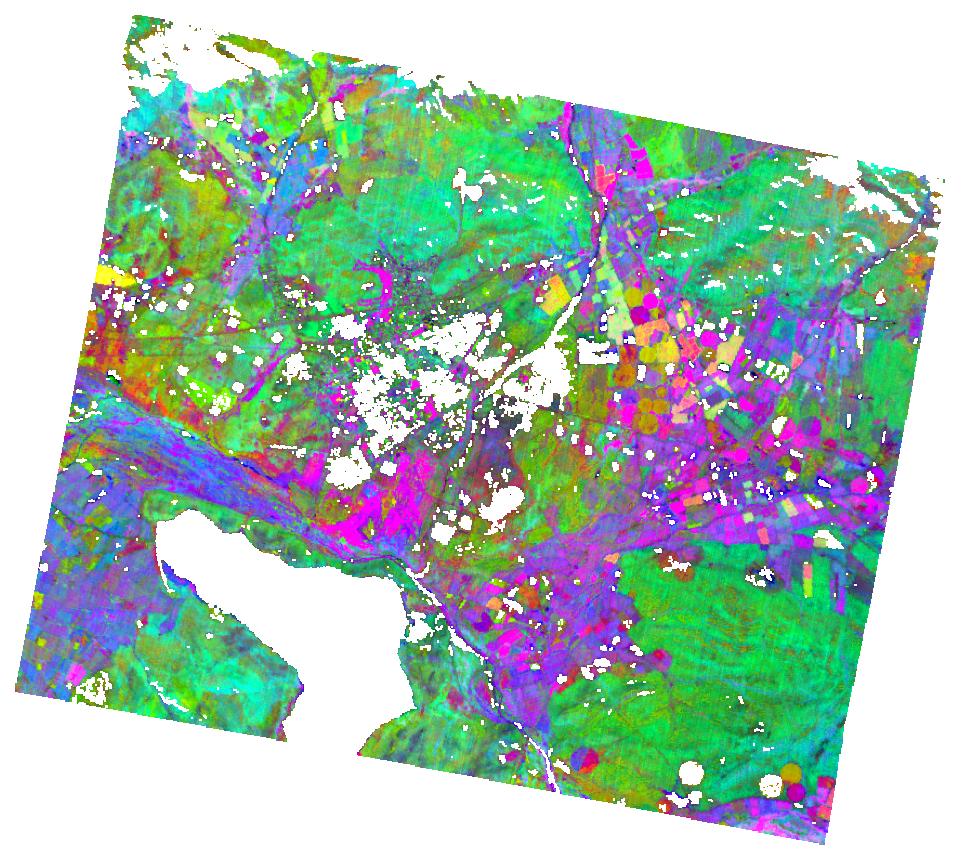

# Tanager Data Competition Entry

This repository is a submission to Planet's [2026 Tanager Open Data Competition](https://learn.planet.com/2026-Tanager-Open-Data-Competition.html). It applies existing BioSCape-trained foliar trait models (Cape Floristic Region, South Africa) to Planet's example Tanager-1 release scene to produce trait maps, then cross-checks those predictions against an independent spaceborne sensor (EMIT) and BioSCape's own airborne imagery over the same area. See `writeup/report_draft.md` for the full analysis and results.

*Ternary composite (nitrogen (red) / lignin (green) / calcium (blue)) predicted from the Tanager scene north of the Brandvlei dam, South Africa. Predicted traits are normalized to this scene's own value range for visual impact (the report's
actual analysis figures use ranges normalized to regional field data instead). See `writeup/report_draft.md` for the full write-up, `code/step15_readme_banner_ternary.py` for this banner image, and `code/step5_ternary_map.py` for the report's field-referenced
version.*

## Reproducibility note

This repository's code is public and documents the full method, but not
every input dataset is publicly available yet. Below is a breakdown of what is
independently obtainable versus internally stored at EnSpec:

- **Publicly available, independent of this project**: the Tanager scene
  (Planet's open STAC catalog), the EMIT granule (NASA Earthdata), and the
  AVIRIS-NG L2B reflectance product once [Kovach et al. 2025](https://doi.org/10.3334/ORNLDAAC/2385)
  is fully released.
- **Not yet public**: the BioSCape trait-model coefficient files this
  project applies to Tanager/EMIT (from Frye et al., in review at ORNL
  DAAC — see `writeup/report_draft.md` for citation details) and the
  California (SHIFT) trait models used in the supplementary code below,
  provided directly by a collaborator and not yet deposited anywhere
  public.
- **Internal lab infrastructure, not part of this repository**: this
  project's own intermediate/output data lives on the lab's internal
  server (see `internal_data_map.md`, not included in this public
  repository), and a few reference scripts/configs are reused from
  other, currently-private lab repositories (referenced in code
  comments and the run order below). An external reader can follow the
  method in full from the code, but cannot literally re-run this
  pipeline end to end without either lab server access or the
  not-yet-public model files above.

## Input data

**Example scene**: `20250504_092952_87_4001_basic_sr_hdf5.h5` (~1 GB), from
[open-cogs/planet-stac/tanager1-release2-core-imagery](https://storage.googleapis.com/open-cogs/planet-stac/tanager1-release2-core-imagery/basic_sr_hdf5/20250504_092952_87_4001_basic_sr_hdf5.h5).
Covers roughly lat -33.76 to -33.55, lon 19.33 to 19.61 (Cape Town /
Jonkershoek area) — good overlap with BioSCape validation sites.

## Tanager `basic_sr_hdf5` format

**Not** a NEON-schema HDF5 file — HyTools' `neon` reader (or any of its
other `file_type`s: `envi`, `emit`, `ncav`) will not open it. It's an
HDF-EOS5 **swath** product:

- Reflectance: `HDFEOS/SWATHS/HYP/Data Fields/surface_reflectance`, shape
  `(426 bands, 587 along-track, 607 cross-track)`, float32, band-first.
- `wavelengths`, `fwhm`, `good_wavelengths` (QA mask, 368/426 good) are
  **attrs on the reflectance dataset itself**, not separate datasets.
  376.4–2499.0 nm.
- Geolocation is per-pixel `Latitude`/`Longitude` swath grids (not an
  affine transform on the data) — this is unprojected swath geometry.
  A `Planet_Ortho_Framing` attr on the Geolocation Fields group gives a
  target ortho grid to warp onto: `859 cols x 767 rows`, 30 m, EPSG:32734
  (UTM 34S), geotransform `[345660.0, 30.0, 0.0, 6286110.0, 0.0, -30.0]`.
- Other per-pixel fields available: `sensor_zenith/azimuth`,
  `sun_zenith/azimuth`, `sensor_to_ground_path_length`,
  `aerosol_optical_depth`, `column_water_vapour`, `beta_cloud_mask`,
  `beta_cirrus_mask`, `nodata_pixels`.

Full structure dump: `code/step1_inspect_tanager_h5.py` (reads the file via
`fsspec` HTTP range requests — no download needed to re-inspect).

**Approach**: the scene is small (426×587×607 float32 ≈ 575 MB, fits in
RAM) — HyTools' Ray/chunked-iterator machinery exists for tiles too big to
hold in memory and isn't worth adapting here. Trait application is a
standalone `h5py` + `numpy` script that mirrors the core PLSR math from
this lab's existing airborne trait-application pipeline (vector-normalize,
coefficient dot product + intercept) rather than a new HyTools reader.

## Run order

The steps below document this project's full codebase, including
supplementary California/SHIFT code (steps 8, 9, and 13) that was not
carried through to the final submitted report — see
`writeup/report_draft.md` for the analysis actually presented to the
competition. That work explored whether the cross-sensor methodology
generalizes to a second, independently-trained model library, but was
set aside as insufficiently validated (no ground truth was checked
against a Tanager scene for either the BioSCape or SHIFT models there).
It's included here for completeness and transparency about what this
codebase can do.

1. `step1_inspect_tanager_h5.py` — dump the h5 structure (done; see above)
2. Download the scene to `raw_h5/` (done)
3. `step2_apply_trait_model.py` — reads the h5 cube, Gaussian-resamples
   onto the BioSCape (AVIRIS-NG-trained) trait models' band grid, applies
   PLSR coefficients, grids the swath onto the `Planet_Ortho_Framing` UTM
   target via the Lat/Lon arrays, writes GeoTIFFs to `trait_outputs/`.
   Uses the BioSCape-trained models, not the NEON-trained ones used in
   earlier smoke tests — see `writeup/report_draft.md`, Section 2, for
   the cross-sensor FWHM-matching approach and the full-spectrum vs.
   infrared-only model-variant comparison. **All four kept traits
   (nitrogen, calcium, lignin, cellulose) use the full-spectrum
   variant** — infrared-only checked out worse against field data for
   every trait tried.
4. `step3_ground_validation.py` — checks CWM ground plots against the
   scene footprint; currently reports **zero overlap** for this scene
   (nearest plot cluster ~17.5 km outside the edge). A denser regional
   leaf-trait survey (Frye et al., 2026, thousands of points) also has
   zero overlap (nearest ~60 km) — see `writeup/report_draft.md`,
   Section 3. No formal or ballpark validation is possible against this
   specific scene; folded into the coverage-gap pitch instead.
5. `step4_ndvi_shadow_mask.py` — NDVI + a simple NIR-brightness shadow
   mask + combined vegetation mask, gridded to match the trait maps.
6. `step5_ternary_map.py` — 3-trait RGB composite (default:
   nitrogen/lignin/calcium), normalized to region-wide CWM field-data
   ranges (not the scene's own range — see `writeup/report_draft.md`,
   Section 3, for why), vegetation-masked via step4.
7. `step6_apply_trait_model_emit.py` — same trait models applied to an
   EMIT L2A scene (2026-03-02) for a cross-sensor comparison. Result:
   strong agreement with Tanager over the same AOI (nitrogen/cellulose
   within ~5-8% at the median, calcium/lignin within ~12-23% but in the
   same direction as their known field-data biases) — see
   `writeup/report_draft.md`, Section 4.
8. `step7_emit_tanager_density.py` — density-distribution comparison
   (KDE overlays) of Tanager vs. EMIT predicted values, same AOI as the
   percentile table above. `figures/emit_vs_tanager_density.png`.
9. `step8_apply_trait_model_california.py` *(supplementary, not in the
   submitted report — see note above)* — applies a colleague's SHIFT
   (Santa Barbara)-trained models to a Tanager scene over the same
   footprint, as an exploratory generalizability check.
10. `step9_ndvi_shadow_mask_california.py` *(supplementary)* — same
    treatment as step4 for the California scene.
11. `step10_mosaic_aviris_aoi.R` — mosaics BioSCape's own AVIRIS-NG L3
    trait tiles (Nov 2023) over this scene's footprint (30.6% coverage,
    24 tiles across 6 flightlines, none previously mosaicked for this
    area). R/terra. Output: internal `aviris_aoi_mosaic/` (see
    `internal_data_map.md`). See `writeup/report_draft.md`, Section 5,
    for the comparison result (nitrogen matches closely; the other
    traits carry a model-variant caveat).
12. `step11_tanager_emit_sidebyside_maps.py` — side-by-side Tanager vs.
    EMIT trait maps, all 4 traits, EMIT reprojected onto Tanager's grid,
    same field-referenced color scale as the ternary map.
    `figures/tanager_vs_emit_sidebyside_maps.png`.
13. `step12_nitrogen_tanager_emit_aviris.py` — separate 3-panel figure
    (Tanager | EMIT | AVIRIS-NG airborne), nitrogen only — the one trait
    where the AVIRIS-NG comparison is empirically supported. Kept out of
    step11's figure since AVIRIS-NG only covers 30.6% of the scene and
    the other traits carry a model-variant caveat.
    `figures/nitrogen_tanager_emit_aviris.png`.
14. `step13_california_sidebyside_maps.py` *(supplementary)* — all
    California SHIFT traits in a grid, relative low/med/high terciles
    per trait since there's no field validation for this scene.
    `figures/california_sidebyside_maps.png`.
15. `step14_tanager_emit_difference_map.py` — per-pixel (EMIT − Tanager)
    difference, all 4 Cape traits. Diagnostic, not just cosmetic: lignin
    shows a uniform offset (consistent with sensor calibration), calcium
    shows real spatial structure (south vs. north of the scene), nitrogen
    is small/patternless, cellulose is noisy.
    `figures/tanager_emit_difference_map.png`.

## Environment

- **Python**: this repository has its **own isolated venv** —
  `python3 -m venv .venv && .venv/bin/pip install -r requirements.txt`.
  Do **not** install into a shared base conda environment: `rasterio`/
  `pyproj` pull in numpy 2.x, which can break version pins other
  projects rely on in a shared environment. Always run this repository's
  scripts with `.venv/bin/python3`.
