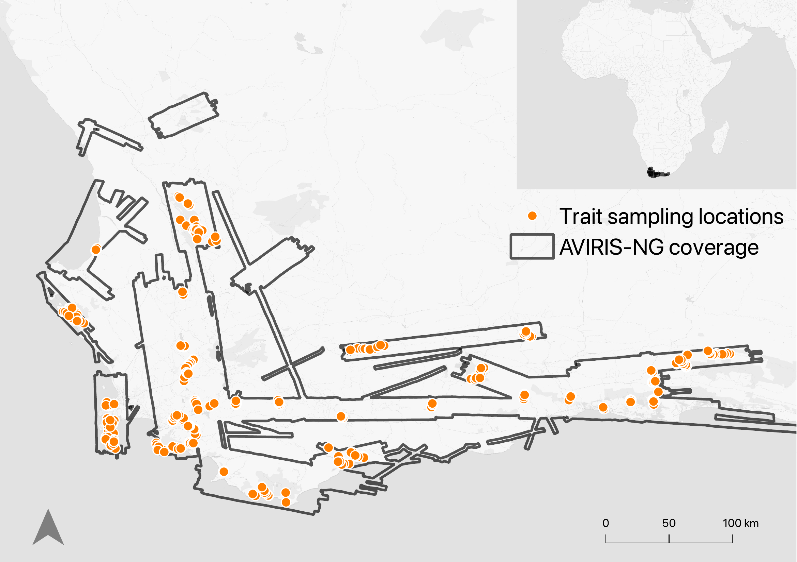
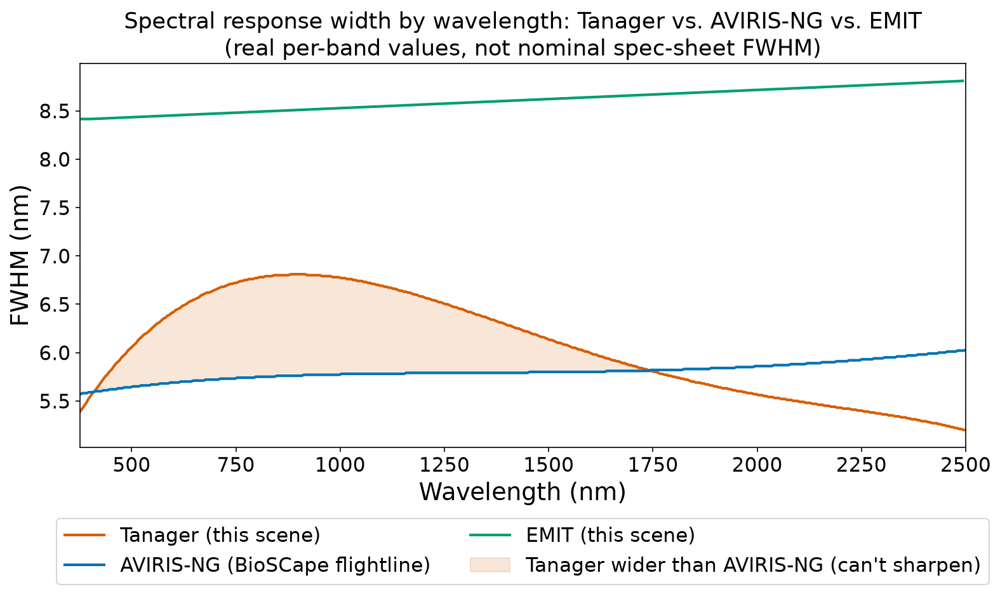
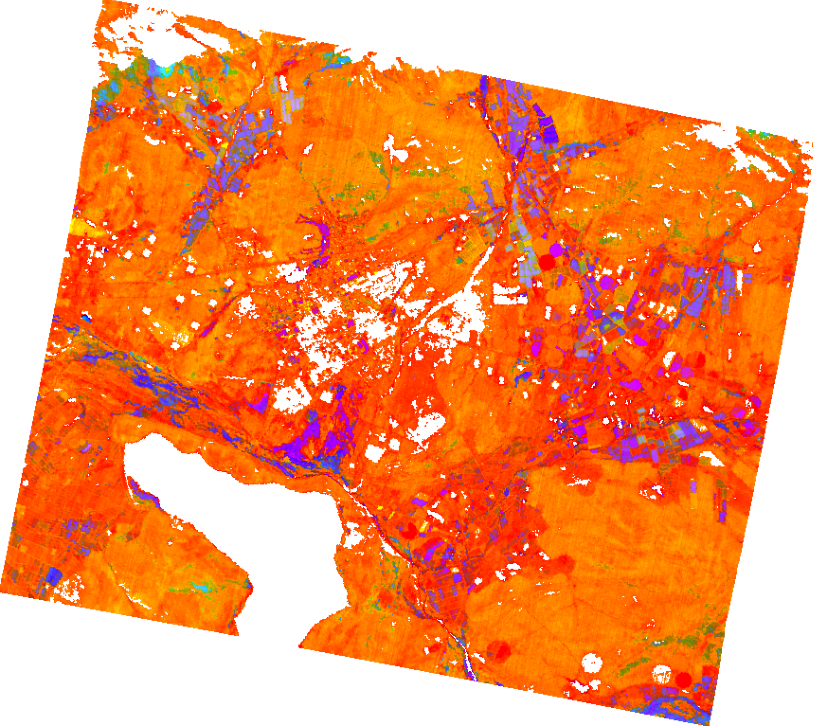
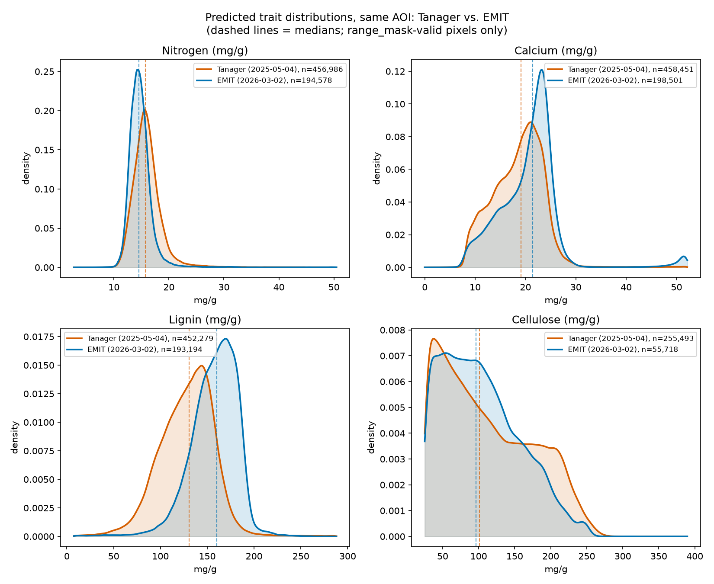
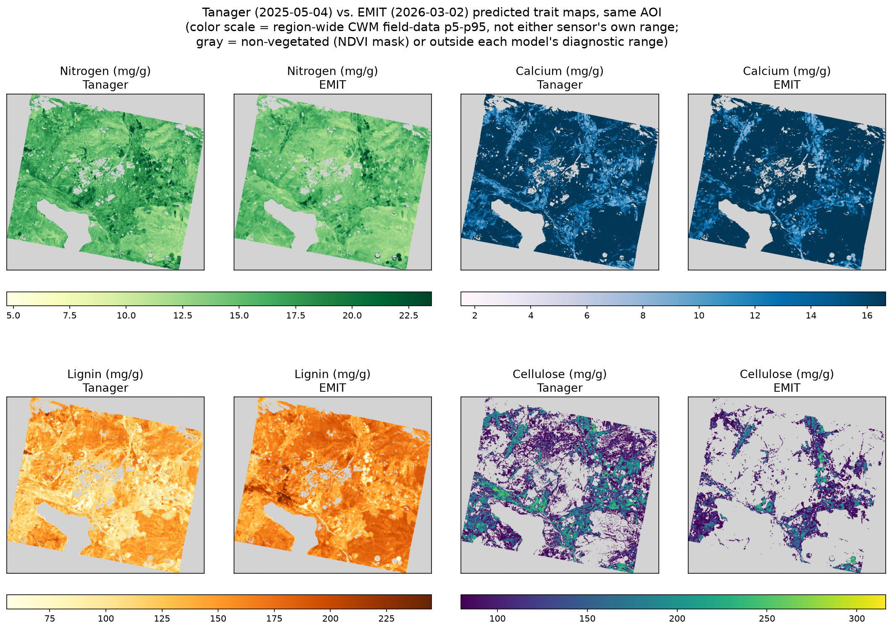
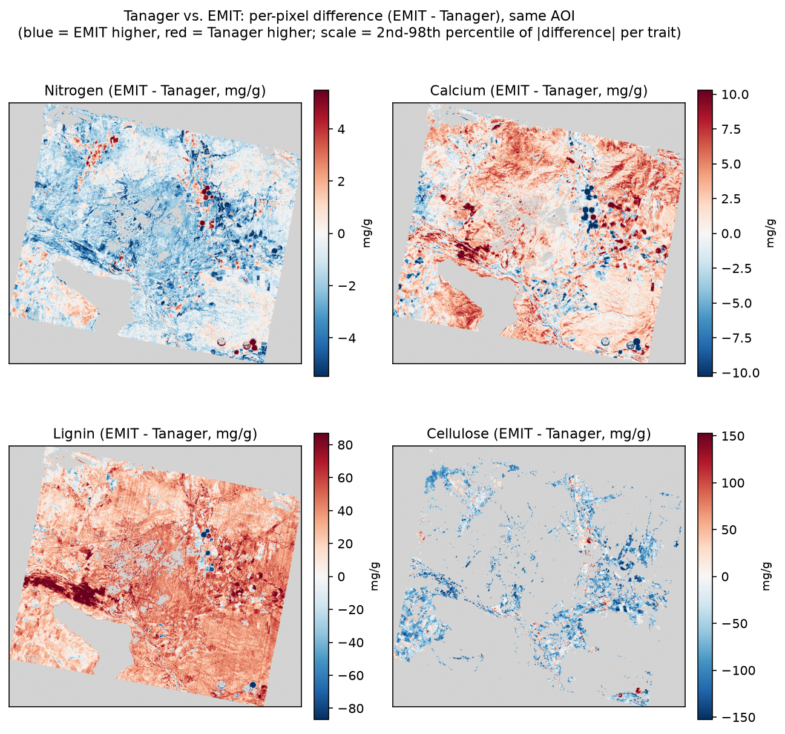
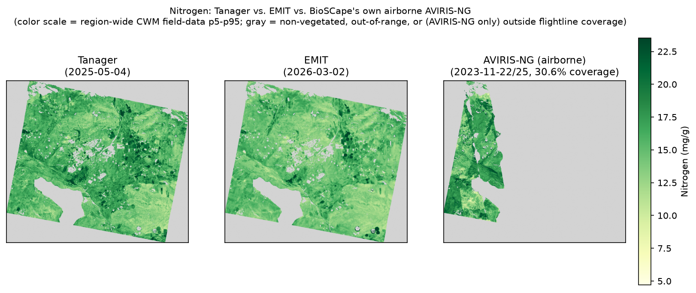

# Cross-Sensor Transfer of Airborne Trait Models to Tanager: A BioSCape Case Study

---

## 1. Can Tanager Deliver Airborne-Quality Foliar Trait Maps From Orbit?

Measuring the distribution of foliar traits across landscapes is key to
understanding ecological processes at spatial extents relevant for
conservation decisions and policy making. Airborne imaging spectroscopy
has been used for decades to robustly predict a wide suite of structural
and biochemical plant traits across a variety of ecosystems. These
airborne acquisitions and their paired ground-collected data are
increasingly used to train models applied to space-borne sensors such as
EMIT. Tanager is well-poised to serve as an alternative source of
space-borne trait maps, with the advantage of being able to respond to
ecological disturbances more nimbly than current airborne acquisitions and planned
missions like EAGLE-VSWIR.

The NASA-led Biodiversity Survey of the Cape ([BioSCape](https://www.bioscape.io)) offers a well-documented example of exactly this kind of
airborne-trained resource, and is a natural test case for whether it can be put to work on a new platform. The 2023 campaign acquired near wall-to-wall coverage with the AVIRIS-NG sensor over the Cape Floristic Region (CFR), a global biodiversity hotspot and a region particularly affected by global change. Along with fieldwork led by the [Townsend lab](https://townsend.russell.wisc.edu) resulting in 542 field plots and thousands of leaf chemistry samples, this project has built one of the
richest foliar trait-model libraries that exists for any biodiversity
hotspot on Earth (Cardoso et al., 2025). These efforts resulted in foliar trait maps for 20 traits across the CFR. These maps were trained entirely on one airborne sensor, over one campaign, in one region. We now have the opportunity to test whether our results derived from the airborne campaign align with results we might derive from space-borne measurements.

**Can an existing, independently-trained trait model transfer to
a brand-new commercial hyperspectral platform with *zero recalibration*?**
That's the question this project set out to answer, using Tanager's
example release scene over the Cape Floristic Region.

The answer, in short, is **yes** — and the caveats along the way turn out to be
as informative as the successes.

Missions like EAGLE-VSWIR will inherit this exact question the moment
they launch: how do trait models trained on one instrument transfer to
another, and what does it take to make that transfer credible rather
than aspirational. **Tanager, already in orbit, is a chance to work out
the answer now.**

*Figure 1. AVIRIS-NG flight box coverage (outlines) and trait sampling
locations (orange points) across the Cape Floristic Region, 2023 BioSCape
campaign.*

## 2. Data and methods

**Sensors and products used:**

| Source | Role | Coverage used |
|---|---|---|
| Tanager (`basic_sr_hdf5`, Guido et al. 2025) | Primary test platform | Cape scene (2025-05-04) |
| AVIRIS-NG (BioSCape campaign, Kovach et al. 2025) | Trait model training data + independent airborne validation | Nov 2023, Cape region |
| EMIT | Independent space-borne cross-check | 2026-03-02, same Cape area of interest (AOI) |

**Trait models**: BioSCape's PLSR (partial least squares regression)
foliar trait models — Nitrogen, Calcium, Lignin, and Cellulose — four of the 20 traits in the full product — were trained on
AVIRIS-NG L2B enhanced surface reflectance (Kovach et al., 2025) and
community-weighted-mean trait values from 542 plots collected
concurrent with image acquisition (median 9-day mismatch between plot
sampling and overpass). Training used an ensemble permutational approach:
an 85/15 train/validation split, with the 85% further split 30 times to
select the optimal number of PLSR components, repeated across 200
iterations to yield 200 models per trait — the mean prediction and the
standard deviation across those 200 iterations are what this project
treats as each trait's mean and uncertainty layers.

**Cross-sensor spectral matching**: Applying an AVIRIS-NG-trained model to
Tanager reflectance isn't a matter of matching wavelengths alone — the two
sensors have different spectral response widths (FWHM) at every band.
Tanager's FWHM runs 5.2–6.8 nm depending on wavelength; AVIRIS-NG's is
flatter, 5.6–6.0 nm. We built each target band as a Gaussian relative
spectral response, using the quadrature difference between the two
sensors' real FWHM to determine the matching kernel width — not a generic
resampling, and not assuming either sensor's nominal spec sheet FWHM
matches its as-flown FWHM (we pulled AVIRIS-NG's real per-band FWHM from
an actual corrected flightline rather than the trait model's own metadata,
which didn't carry it).

*Figure 2. Real per-band FWHM by wavelength (not nominal spec-sheet
values). Tanager runs wider than AVIRIS-NG across most of 400-1750 nm
(62% of Tanager bands, shaded region).*

**Model variant**: BioSCape's trait models come in two spectral-range
flavors per trait — infrared-only (1000–2450 nm) and full-spectrum
(450–2450 nm). The BioSCape team's own same-sensor comparison between the
two found broadly similar performance and adopted infrared as the project
default (more parsimonious, avoids co-correlation with visible-region
pigments), with lignin as the one documented exception favoring the
full-spectrum model (Frye et al., in review). We used full-spectrum
models for every trait in this project instead — Section 3 shows why that
departs from the same-sensor default here.

**Vegetation masking**: Model training for the BioSCape trait maps
excluded pixels below NDVI 0.4 or below 0.1 reflectance at 807 nm, to
remove non-vegetated and shadowed pixels (Frye et al., in review). We
independently derived a masking threshold for the Tanager Cape scene
directly from its own reflectance histogram rather than reusing these
values outright, since surface reflectance levels aren't necessarily
comparable band-for-band across sensors and processing pipelines. We
ultimately used a similar NDVI-plus-NIR-brightness approach.

## 3. Cape Floristic Region trait maps

To assess whether predictions from the BioSCape models, applied to the Tanager scene, were realistic, we checked the predicted values against
646 community-weighted-mean field plot values across the Cape Floristic
Region — none of which happen to fall inside this specific scene
(nearest cluster is 17.5 km outside the scene edge). A broader regional
survey (~2,500–9,500 individual leaf samples: Frye et al., 2026, *Foliar
Trait and Spectroscopy Data, Greater Cape Floristic Region, South
Africa*, ORNL DAAC, https://doi.org/10.3334/ORNLDAAC/2482) has zero
overlap too, with its nearest sample ~60 km away. This is one of the most densely ground-truthed landscapes for foliar traits anywhere, yet neither dataset happens to fall inside the one Tanager scene currently in the open catalog for this area. Nitrogen and Lignin transfer best:

| Trait | Predicted median | Field (CWM) median | % within model's own valid range |
|---|---|---|---|
| Nitrogen | 15.74 mg/g | 9.73 mg/g | 95.0% |
| Lignin | 130.68 mg/g | 148.81 mg/g | 94.0% |
| Calcium | 19.08 mg/g | 7.24 mg/g | 95.3% |
| Cellulose | 101–107 mg/g | 161.63 mg/g | 53.1% |

It's worth noting that the predictive performance of these traits wasn't equally strong: BioSCape's own validation (independent AVIRIS-NG holdout
data, not cross-sensor; Frye et al., in review) reports Nitrogen and
Calcium as more reliable models (NRMSE 0.109 and 0.081, Nash-Sutcliffe
Efficiency 0.313 and 0.26), with Lignin and Cellulose already weaker
same-sensor (NRMSE 0.192 and 0.164, NSE 0.182 and 0.247). Lignin's strong
cross-sensor field match despite a middling same-sensor score is notable
on its own; Cellulose's cross-sensor weakness is at least partly
inherited rather than purely a transfer artifact.

Lignin is the closest match to field values outright. 95% of vegetated
pixels for Nitrogen and Calcium pass their own model's mask constrained to the minimum and maximum of the observed ground values. Nitrogen's absolute values do track the field data closely, but Calcium's don't — it runs roughly 2.6x higher, a bias that only surfaced once we checked against real field values instead of relying on that basic bounds check. Cellulose is the weakest of the four: only about half of vegetated pixels pass the observed min/max mask.

*Figure 3. Ternary composite (Nitrogen/Lignin/Calcium), normalized to
region-wide CWM field-data ranges.*

## 4. Cross-sensor comparison: EMIT

No EMIT overpass exists near Tanager's exact acquisition date — the
nearest same-year passes were 71–101 days off-season. Checking day-of-year
proximity across every EMIT acquisition ever made over this footprint
(EMIT is hosted onboard the International Space Station (ISS), meaning that coverage is opportunistic, not a fixed revisit) found a much closer seasonal match a year earlier
(15 days off), but that pass's swath only clips 17% of the scene. We chose
the best full-coverage option instead: 2026-03-02, 63 days off-season but
100% AOI coverage in a single granule.

Despite the platform difference, processing pipeline difference, and
~10-month acquisition gap, predicted trait values agree closely over the
same ground:

| Trait | Tanager median | EMIT median | Agreement |
|---|---|---|---|
| Nitrogen | 15.74 mg/g | 14.54 mg/g | ~8% |
| Cellulose | 101.33 mg/g | 96.58 mg/g | ~5% |
| Calcium | 19.08 mg/g | 21.46 mg/g | ~12% |
| Lignin | 130.68 mg/g | 160.24 mg/g | ~23% |

Calcium and Lignin's larger gaps run in the *same direction* as their
bias against field data (Section 3) — suggesting these are properties of
the cross-sensor transfer methodology itself, not something specific to
either satellite.

*Figure 4. Density-distribution comparison (KDE), same AOI used
throughout this section. Nitrogen and Cellulose overlap closely; Calcium
and Lignin show a visible rightward shift for EMIT.*

*Figure 5. Tanager vs. EMIT predicted trait maps, same AOI, same
field-referenced color scale per trait. EMIT reprojected onto Tanager's
exact grid.*

*Figure 6. Per-pixel difference (EMIT minus Tanager), all 4 traits.*

Within the difference map, Lignin's offset is
close to **uniform across the entire scene** — consistent with a
systematic sensor/calibration difference rather than a land cover effect.
Calcium's disagreement, by contrast, has real **spatial structure** — the
southern part of the scene runs noticeably higher for EMIT than the
north, which is not what you'd expect from simple noise. A number of
individual agricultural fields also stand out with especially large
differences — plausibly real differences in crop type, management
practice, or phenological stage between the two acquisition dates (ten
months apart) rather than a sensor artifact. Field-level variability like
that could also be contributing to the shape differences in the
aggregate trait distributions (density plot above), not just a uniform
cross-sensor offset.

## 5. Cross-sensor comparison: comparing airborne AVIRIS-NG to space-borne products

BioSCape's own AVIRIS-NG airborne campaign flew directly under part of
this Tanager scene in November 2023 — 30.6% of the footprint, across 24
processed flightline tiles. We built a mosaic that chooses the low-uncertainty pixel in the case of flightline tile overlap and
compared it against the Tanager and EMIT predictions in the overlap area.

For Nitrogen, all three independently-processed products land close
together:

| Product | Median (mg/g) |
|---|---|
| Tanager | 15.72 |
| EMIT | 14.58 |
| AVIRIS-NG (airborne) | 16.92 |

*Figure 7. Nitrogen predicted by three independently-processed products
over the same AOI -- Tanager, EMIT, and BioSCape's own airborne
AVIRIS-NG (30.6% scene coverage, shown as a narrow strip at its actual
footprint). The AVIRIS-NG strip's spatial pattern visibly echoes the
same subregion in the Tanager and EMIT panels.*

We're presenting this three-way comparison for Nitrogen only. The
precomputed AVIRIS-NG trait tiles use a different model variant
(IR-only) than what we determined works best for Tanager/EMIT
(Section 2) for three of the four traits. This conflict is an interesting finding arising out of cross-sensor application and could originate from differences in atmospheric correction procedures and sensor calibration.

## 6. The ask: increasing Tanager coverage of data-rich biodiverse regions

Tanager is well positioned to become an invaluable resource as a producer of high quality foliar trait maps across the globe. These trait maps can be used in numerous domains including agriculture, forestry, and conservation management. As we have demonstrated in this short report, existing datasets can readily be applied to generate reasonable products.

**High priority area for future Tanager acquisitions**: more coverage of
the Cape Floristic Region, specifically scenes that overlap BioSCape's
existing ground-truth plot network and processed airborne imagery. This
region has more validation infrastructure per square kilometer than
almost anywhere else hyperspectral trait models get tested — the
current open-catalog scene simply doesn't reach any of it.

---

## References

Cardoso, A. W., Hestir, E. L., Slingsby, J. A., Forbes, C. J., Moncrieff,
G. R., Turner, W., Skowno, A. L., Nesslage, J., Brodrick, P. G., Gaddis,
K. D., & Wilson, A. M. (2025). The biodiversity survey of the Cape
(BioSCape), integrating remote sensing with biodiversity science. *npj
Biodiversity*, 4(1), 2. https://doi.org/10.1038/s44185-024-00071-5

Kovach, K. R., Ye, Z., Frye, H., & Townsend, P. A. (2025). BioSCape:
AVIRIS-NG L2B Enhanced Surface Reflectance (Version 1) [netCDF]. ORNL
Distributed Active Archive Center. https://doi.org/10.3334/ORNLDAAC/2385

Frye, H. A., Euston-Brown, D., Kovach, K. R., Slingsby, J., Ye, Z., &
Townsend, P. A. (in review). BioSCape foliar trait maps derived from
AVIRIS-NG imagery. ORNL Distributed Active Archive Center. *(DOI pending
— citation covers the 542-plot training design, model performance table,
IR-vs-full-spectrum comparison, and vegetation masking thresholds
referenced in Sections 2-3. Expected public by the time this competition
is reviewed, per Henry.)*

Frye, H., Aiello-Lammens, M. E., Euston-Brown, D., Jones, C. S., Kilroy
Mollmann, H., Merow, C., Slingsby, J. A., van der Merwe, H., Turner, R.,
Wilson, A. M., & Silander Jr, J. A. (2026). Foliar Trait and Spectroscopy
Data, Greater Cape Floristic Region, South Africa (Version 1). ORNL
Distributed Active Archive Center. https://doi.org/10.3334/ORNLDAAC/2482
*(GCFR leaf-sample survey used in Section 3's regional check. Note:
values used in this project came from a pre-release update ahead of this
published V1 -- nitrogen unaffected, LMA revised but not used here.)*

Guido, J., Keremedjiev, M., Mason, J., Duren, R., Lai-Norling, J.,
Seaman, K., & Green, R. (2025, August). Advanced hyperspectral imaging
from orbit: achievements and challenges from the first year of
Tanager-1. In Proceedings of the Small Satellite Conference, Salt Lake
City, UT, USA (pp. 10-13).
