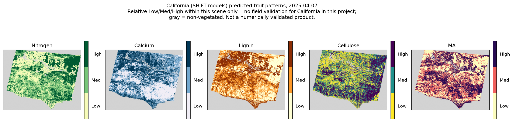

# Cross-Sensor Transfer of Airborne Trait Models to Tanager: A BioSCape Case Study

---

## 1. Can Tanager Deliver Airborne-Quality Foliar Trait Maps From Orbit?

Measuring the distribution of foliar traits across landscapes is key to
understanding ecological processes at spatial extents relevant for
conservation decisions and policy making. Airborne imaging spectroscopy
has been used for decades to robustly predict a wide suite of structural
and biochemical plant traits across a variety of ecosystems. These
airborne acquisitions and their paired ground-collected data are
increasingly used to train models applied to space-borne sensors such as
EMIT. Tanager is well-poised to serve as an alternative source of
space-borne trait maps, with the advantage of being able to respond to
ecological disturbances more nimbly than current data sources and planned
missions like EAGLE-VSWIR.

The NASA-led Biodiversity Survey of the Cape ([BioSCape](https://www.bioscape.io)) offers a well-documented example of exactly this kind of
airborne-trained resource, and is a natural test case for whether it can be put to work on a new platform. The 2023 campaign acquired near wall-to-wall coverage with the AVIRIS-NG sensor over the Cape Floristic Region (CFR), a global biodiversity hotspot and a region particularly affected by global change. Along with fieldwork led by the [Townsend lab](https://townsend.russell.wisc.edu) resulting in 542 field plots and thousands of leaf chemistry samples, this project has built one of the
richest foliar trait-model libraries that exists for any biodiversity
hotspot on Earth (Cardoso et al., 2025). These efforts resulted in foliar trait maps for 20 traits across the CFR. These maps were trained entirely on one airborne sensor, over one campaign, in one region. Tanager is a new
question mark against all three: a different platform (spaceborne, not
airborne), built and calibrated independently, flying over the same
landscape roughly a year and a half later.

*Figure 1. AVIRIS-NG flight box coverage (outlines) and trait sampling
locations (orange points) across the Cape Floristic Region, 2023 BioSCape
campaign. PNG here for preview; the source PDF (vector, on Enspec at
`figures/bioscape_sampling.pdf`) is what to embed in the final submission
for print-quality rendering.*

**Can an existing, independently-trained trait-model library transfer to
a brand-new commercial hyperspectral platform with *zero recalibration*?**
That's the question this project set out to answer, using Tanager's
example release scene over the Cape Floristic Region — and, once the
methodology proved out, a second scene over California to test whether it
generalizes across continents.

The answer, in short is **yes** — and the caveats along the way turn out to be
as informative as the successes.

Missions like EAGLE-VSWIR will inherit this exact question the moment
they launch: how trait models trained on one instrument transfer to
another, and what it takes to make that transfer honest rather than
aspirational. Tanager, already on orbit, is a chance to work out the
answer now.

## 2. Data and methods

**Sensors and products used:**

| Source | Role | Coverage used |
|---|---|---|
| Tanager (`basic_sr_hdf5`) | Primary test platform | Cape scene (2025-05-04), California scene (2025-04-07) |
| AVIRIS-NG (BioSCape campaign, Kovach et al. 2025) | Trait model training data + independent airborne validation | Nov 2023, Cape region |
| EMIT | Independent spaceborne cross-check | 2026-03-02, same Cape area of interest (AOI) |
| AVIRIS-NG (SHIFT campaign, Chadwick et al. 2025) | Trait model training data, California | Santa Barbara, exact dates TBC |

† *SHIFT background: [earthdata.nasa.gov/data/projects/shift](https://www.earthdata.nasa.gov/data/projects/shift). Imagery used for training confirmed by Ting (matches DAAC documentation): Brodrick et al., 2023, SHIFT: AVIRIS-NG L2A Unrectified Surface Reflectance V1, ORNL DAAC, https://doi.org/10.3334/ORNLDAAC/2376. (The California model json also carries a `spectrometer: "avc+neon"` metadata tag; confirmed with Ting, who provided the model, that this is a stale artifact from a script originally built for WDTS data, left in by mistake — the SHIFT model is trained on SHIFT field data only, same AVIRIS-NG platform as BioSCape.)*

**Trait models**: BioSCape's PLSR (partial least squares regression)
foliar trait models — Nitrogen, Calcium, Lignin, Cellulose, and leaf mass
per area (LMA) of the 20 traits in the full product — were trained on
AVIRIS-NG L2B enhanced surface reflectance (Kovach et al., 2025) and
community-weighted-mean field chemistry from 542 plots collected
concurrent with image acquisition (median 9-day mismatch between plot
sampling and overpass). Training used an ensemble permutational approach:
an 85/15 train/validation split, with the 85% further split 30 times to
select the optimal number of PLSR components, repeated across 200
iterations to yield 200 models per trait — the mean prediction and the
standard deviation across those 200 iterations are what this project
treats as each trait's mean and uncertainty layers. A second,
independently-trained model set from the SHIFT campaign (Santa Barbara,
CA; Chadwick et al., 2025) — same AVIRIS-NG platform, different campaign
and field dataset — was used for the California test.

**The core technical problem**: Tanager's `basic_sr_hdf5` format is not
readable by existing trait-modeling pipelines (HyTools, built for this
lab's airborne processing, has no reader for it — it's a different HDF5
schema entirely, not the NEON format its one HDF5 reader expects). We
built a standalone reader and resampling pipeline instead of forcing
Tanager into infrastructure designed for large airborne tiles.

**Cross-sensor spectral matching**: applying an AVIRIS-NG-trained model to
Tanager reflectance isn't a matter of matching wavelengths alone — the two
sensors have different spectral response widths (FWHM) at every band.
Tanager's FWHM runs 5.2–6.8 nm depending on wavelength; AVIRIS-NG's is
flatter, 5.6–6.0 nm. We built each target band as a Gaussian relative
spectral response, using the quadrature difference between the two
sensors' real FWHM to determine the matching kernel width — not a generic
resampling, and not assuming either sensor's nominal spec sheet FWHM
matches its as-flown FWHM (we pulled AVIRIS-NG's real per-band FWHM from
an actual corrected flightline rather than the trait model's own metadata,
which didn't carry it).

**Model variant**: BioSCape's trait models come in two spectral-range
flavors per trait — infrared-only (1000–2450 nm) and full-spectrum
(450–2450 nm). The BioSCape team's own same-sensor comparison between the
two found broadly similar performance and adopted infrared as the project
default (more parsimonious, avoids co-correlation with visible-region
pigments), with lignin as the one documented exception favoring the
full-spectrum model (Frye et al., in review). We used full-spectrum
models for every trait in this project instead — Section 3 shows why that
departs from the same-sensor default here.

**Vegetation masking**: model training for the BioSCape trait maps
excluded pixels below NDVI 0.4 or below 0.1 reflectance at 807 nm, to
remove non-vegetated and shadowed pixels (Frye et al., in review). We
independently derived masking thresholds for each scene used in this
project (Tanager Cape, Tanager California) directly from that scene's own
reflectance histogram rather than reusing these values outright, since
surface reflectance levels aren't necessarily comparable band-for-band
across sensors and processing pipelines — but landed on a similar
NDVI-plus-NIR-brightness approach.

## 3. Cape Floristic Region trait maps

To assess whether predictions using the BioSCape models applied to the
Tanager scene were realistic, we checked the predicted values against
646 community-weighted-mean field plot values across the Cape Floristic
Region (none of which happen to fall inside this specific scene — see
Section 6). Nitrogen and Lignin transfer best:

| Trait | Predicted median | Field (CWM) median | % within model's own valid range |
|---|---|---|---|
| Nitrogen | 15.74 mg/g | 9.73 mg/g | 95.0% |
| Lignin | 130.68 mg/g | 148.81 mg/g | 94.0% |
| Calcium | 19.08 mg/g | 7.24 mg/g | 95.3% |
| Cellulose | 101–107 mg/g | 161.63 mg/g | 53.1% |

It's worth noting that the predictive performance of these traits weren't equally strong: BioSCape's own validation (independent AVIRIS-NG holdout
data, not cross-sensor; Frye et al., in review) reports Nitrogen and
Calcium as more reliable models (NRMSE 0.109 and 0.081, Nash-Sutcliffe
Efficiency 0.313 and 0.26), with Lignin and Cellulose already weaker
same-sensor (NRMSE 0.192 and 0.164, NSE 0.182 and 0.247). Lignin's strong
cross-sensor field match despite a middling same-sensor score is notable
on its own; Cellulose's cross-sensor weakness is at least partly
inherited rather than purely a transfer artifact.

Lignin is the closest match to field values outright. Nitrogen and
Calcium both pass their own model's sanity check on ~95% of vegetated
pixels — but that check is a low bar: it's literally just whether a
prediction falls within the minimum and maximum values ever directly
measured in the field training data, not a statistical confidence
interval. Passing it means a prediction isn't more extreme than anything
recorded on the ground; it says nothing about whether the value is close
to correct. Nitrogen's absolute values do track the field data closely,
but Calcium's don't — it runs roughly 2.6x high, a bias that only
surfaced once we checked against real field values instead of relying on
that basic bounds check. Cellulose is the weakest of the four: only about
half of vegetated pixels pass even that undemanding bar, so we're
presenting it in tables with a clear caveat rather than as a headline
map. LMA was dropped from the Cape analysis entirely — it produced
physically impossible negative values across most of the scene (Section 7
explains the fix that solved this for California).

*Figure 2. Ternary composite (Nitrogen/Lignin/Cellulose), normalized to
region-wide CWM field-data ranges (not the scene's own range -- keeps
trait bias visible rather than auto-stretched away). Clear
agricultural-field vs. natural-vegetation contrast.*

## 4. Cross-sensor comparison: EMIT

No EMIT overpass exists near Tanager's exact acquisition date — the
nearest same-year passes were 71–101 days off-season. Checking day-of-year
proximity across every EMIT acquisition ever made over this footprint
(EMIT's International Space Station (ISS)-hosted, non-repeating orbit means opportunistic coverage, not
a fixed revisit) found a much closer seasonal match a year earlier
(15 days off), but that pass's swath only clips 17% of the scene. We chose
the best full-coverage option instead: 2026-03-02, 63 days off-season but
100% AOI coverage in a single granule.

Despite the platform difference, processing pipeline difference, and
~10-month acquisition gap, predicted trait values agree closely over the
same ground:

| Trait | Tanager median | EMIT median | Agreement |
|---|---|---|---|
| Nitrogen | 15.74 mg/g | 14.54 mg/g | ~8% |
| Cellulose | 101.33 mg/g | 96.58 mg/g | ~5% |
| Calcium | 19.08 mg/g | 21.46 mg/g | ~12% |
| Lignin | 130.68 mg/g | 160.24 mg/g | ~23% |

Calcium and Lignin's larger gaps run in the *same direction* as their
bias against field data (Section 3) — suggesting these are properties of
the cross-sensor transfer methodology itself, not something specific to
either satellite.

*Figure 3. Tanager vs. EMIT predicted trait maps, same AOI, same
field-referenced color scale per trait. EMIT reprojected onto Tanager's
exact grid.*

*Figure 4. Density-distribution comparison (KDE), same AOI as Figure 3 --
Nitrogen and Cellulose overlap closely; Calcium and Lignin show a visible
rightward shift for EMIT.*

*Figure 5. Per-pixel difference (EMIT minus Tanager), all 4 traits.*

The difference map is worth a closer look on its own: Lignin's offset is
close to **uniform across the entire scene** — consistent with a
systematic sensor/calibration difference rather than a landcover effect.
Calcium's disagreement, by contrast, has real **spatial structure** — the
southern part of the scene runs noticeably higher for EMIT than the
north, which is not what you'd expect from simple noise. A number of
individual agricultural fields also stand out with especially large
differences — plausibly real differences in crop type, management
practice, or phenological stage between the two acquisition dates (ten
months apart) rather than a sensor artifact. Field-level variability like
that could also be contributing to the shape differences in the
aggregate trait distributions (density plot above), not just a uniform
cross-sensor offset.

## 5. Cross-sensor comparison: comparing airborne AVIRIS-NG to space-borne products

BioSCape's own AVIRIS-NG airborne campaign flew directly under part of
this Tanager scene in November 2023 — 30.6% of the footprint, across 24
processed flight-line tiles. JPL may have produced its own
reflectance-level mosaics of this imagery, but it had never been
mosaicked into trait-map products for this specific area before this
project (it falls outside all six of BioSCape's existing named regional
trait mosaics). We built that mosaic and
compared it against the Tanager and EMIT predictions in the overlap area.

For Nitrogen, all three independently-processed products land close
together:

| Product | Median (mg/g) |
|---|---|
| Tanager | 15.72 |
| EMIT | 14.58 |
| AVIRIS-NG (airborne) | 16.92 |

*Figure 6. Nitrogen predicted by three independently-processed products
over the same AOI -- Tanager, EMIT, and BioSCape's own airborne
AVIRIS-NG (30.6% scene coverage, shown as a narrow strip at its actual
footprint). The AVIRIS-NG strip's spatial pattern visibly echoes the
same subregion in the Tanager and EMIT panels.*

We're presenting this three-way comparison for Nitrogen only. The
precomputed AVIRIS-NG trait tiles use a different model variant
(IR-only) than what we determined works best for Tanager/EMIT
(Section 2) for three of the four traits. This conflict is an interesting finding arising out of cross-sensor application and could arise from differences in atmospheric correction procedures and sensor calibration.

## 6. Validation, reframed

This region is one of the most densely ground-truthed landscapes for
foliar traits anywhere. We checked two independent field datasets against
this scene's exact footprint:

- **646 community-weighted-mean plots** (BioSCape's own field campaign):
  zero overlap. Nearest cluster is 17.5 km outside the scene edge.
- **~2,500–9,500 individual leaf samples** (a broader regional survey:
  Frye et al., 2026, *Foliar Trait and Spectroscopy Data, Greater Cape
  Floristic Region, South Africa*, ORNL DAAC,
  https://doi.org/10.3334/ORNLDAAC/2482): zero overlap. Nearest sample
  ~60 km away. *(Values used here are from a pre-release update to this
  dataset; nitrogen is unchanged from the published version, though LMA
  has been revised there and isn't used in this comparison.)*

Neither dataset — one built specifically for this region's remote sensing
validation, the other a much denser general survey — happens to fall
inside the one Tanager scene currently in the open catalog for this area.
Even BioSCape's own airborne imagery, flown specifically over this
landscape, only reaches 30% of it (Section 5), and that 30% had never been
processed into a usable product until this project. **The
infrastructure to validate hyperspectral products here is unusually
rich — and the current Tanager coverage still doesn't reach it.**

## 7. Generalizability: California

To test whether this cross-sensor methodology is Cape-specific or
general, we applied a second, independently-trained model set — from
NASA JPL's SHIFT campaign (Santa Barbara, CA; Chadwick et al., 2025),
trained on AVIRIS-NG reflectance and SHIFT's own field-collected foliar
chemistry (same platform as BioSCape, an entirely separate campaign and
region) — to a Tanager scene over the SHIFT study area, using the same
FWHM-matching pipeline built for the Cape.

*Figure 7. California (SHIFT models), all 5 traits, relabeled to
relative Low/Med/High terciles per trait (scene-relative, not a
numeric/field-referenced scale) specifically so this reads as a pattern
check rather than a validated product. Clear mountain/valley/
agricultural contrast still visible, e.g. Nitrogen.*

No ground-truth check has been done for California in this project. What
this section demonstrates is that the *methodology* generalizes across
two different Mediterranean-climate ecosystems on two continents, using
two independently-trained model libraries — not that the California
predictions themselves are numerically validated. Short of field data, we
can still ask whether the landscape pattern matches ecological
expectations: agricultural and vineyard parcels visibly stand out from
surrounding chaparral in the nitrogen map, consistent with fertilized
cropland generally running higher in foliar nitrogen than native
shrubland — a plausibility check, not a validation.

## 8. The ask: increasing Tanager coverage of data-rich biodiverse regions

Tanager is well positioned to become an invaluable resource as a producer of high quality foliar trait maps across the globe. These trait maps can be used in numerous domains including agriculture, forestry, and conservation management. As we have demonstrated in this short report, existing datasets can readily be applied to generate reasonable products.

**High priority areas for future Tanager acquisitions**

1. **More Tanager coverage of the Cape Floristic Region**, specifically
   scenes that overlap BioSCape's existing ground-truth plot network and
   processed airborne imagery. This region has more validation
   infrastructure per square kilometer than almost anywhere else
   hyperspectral trait models get tested — the current open-catalog scene
   simply doesn't reach any of it.
2. **More Tanager coverage of the SHIFT study area in California**, for
   the same reason — an independently-trained, independently-validated
   model library already exists there, ready to be checked against new
   spaceborne data the moment coverage exists. Because SHIFT data was collected across a growing season, this is an ideal test bed for generating trait products across wide spatial domains, but also through time.

---

## References

Cardoso, A. W., Hestir, E. L., Slingsby, J. A., Forbes, C. J., Moncrieff,
G. R., Turner, W., Skowno, A. L., Nesslage, J., Brodrick, P. G., Gaddis,
K. D., & Wilson, A. M. (2025). The biodiversity survey of the Cape
(BioSCape), integrating remote sensing with biodiversity science. *npj
Biodiversity*, 4(1), 2. https://doi.org/10.1038/s44185-024-00071-5

Kovach, K. R., Ye, Z., Frye, H., & Townsend, P. A. (2025). BioSCape:
AVIRIS-NG L2B Enhanced Surface Reflectance (Version 1) [netCDF]. ORNL
Distributed Active Archive Center. https://doi.org/10.3334/ORNLDAAC/2385

Frye, H. A., Euston-Brown, D., Kovach, K. R., Slingsby, J., Ye, Z., &
Townsend, P. A. (in review). BioSCape foliar trait maps derived from
AVIRIS-NG imagery. ORNL Distributed Active Archive Center. *(DOI pending
— citation covers the 542-plot training design, model performance table,
IR-vs-full-spectrum comparison, and vegetation masking thresholds
referenced in Sections 2-3. Expected public by the time this competition
is reviewed, per Henry.)*

Chadwick, K. D., Davis, F., Miner, K. R., Pavlick, R., Reynolds, M.,
Townsend, P. A., Brodrick, P. G., et al. (2025). Unlocking ecological
insights from sub-seasonal visible-to-shortwave infrared imaging
spectroscopy: The SHIFT campaign. *Ecosphere*, 16(3), e70194.
https://doi.org/10.1002/ecs2.70194 *(SHIFT's mission/campaign paper,
parallel to Cardoso et al. 2025 for BioSCape — Ting Zheng, who confirmed
the model training-data question, is a co-author.)*

Brodrick, P. G., Pavlick, R., Bernas, M., Chapman, J. W., Eckert, R.,
Helmlinger, M., Hess-Flores, M., Rios, L. M., Schneider, F. D., Smyth,
M. M., Eastwood, M., Green, R. O., Thompson, D. R., Chadwick, K. D., &
Schimel, D. S. (2023). SHIFT: AVIRIS-NG L2A Unrectified Surface
Reflectance Version 1. ORNL Distributed Active Archive Center.
https://doi.org/10.3334/ORNLDAAC/2376 *(The specific AVIRIS-NG
reflectance product used to train the SHIFT trait models applied in
Section 7 -- confirmed by Ting, matches the DAAC documentation.)*

Frye, H., Aiello-Lammens, M. E., Euston-Brown, D., Jones, C. S., Kilroy
Mollmann, H., Merow, C., Slingsby, J. A., van der Merwe, H., Turner, R.,
Wilson, A. M., & Silander Jr, J. A. (2026). Foliar Trait and Spectroscopy
Data, Greater Cape Floristic Region, South Africa (Version 1). ORNL
Distributed Active Archive Center. https://doi.org/10.3334/ORNLDAAC/2482
*(GCFR leaf-sample survey used in Section 6's regional check. Note:
values used in this project came from a pre-release update ahead of this
published V1 -- nitrogen unaffected, LMA revised but not used here.)*

*(Tanager platform citation still needed — see Open items below.)*

## Appendix: Figure inventory

| # | Figure | Section | File |
|---|---|---|---|
| 1 | Flight-box coverage + sample sites | 1 | `figures/bioscape_sampling.png` (vector source: Enspec `figures/bioscape_sampling.pdf`) |
| 2 | Cape ternary composite (Nitrogen/Lignin/Cellulose), field-referenced | 3 | `figures/ternary_field_referenced.png` |
| 3 | Tanager vs. EMIT, all 4 traits, side by side | 4 | `figures/tanager_vs_emit_sidebyside_maps.png` |
| 4 | Tanager vs. EMIT, density distributions | 4 | `figures/emit_vs_tanager_density.png` |
| 5 | Tanager vs. EMIT, per-pixel difference | 4 | `figures/tanager_emit_difference_map.png` |
| 6 | Nitrogen: Tanager vs. EMIT vs. AVIRIS-NG | 5 | `figures/nitrogen_tanager_emit_aviris.png` |
| 7 | California, all 5 traits (Low/Med/High) | 7 | `figures/california_sidebyside_maps.png` |

All paths are relative to `writeup/`; every file above is committed to
this repo under `writeup/figures/`.

## Appendix: Open items before submission

- [ ] Decide whether to include the FWHM-curve-comparison figure
      mentioned in the outline (Section 2) — not yet built.
- [ ] Cellulose: confirm final call on presenting as a caveated table row
      only (recommended) vs. dropping entirely.
- [ ] Tighten Section 1/8 for final word count once overall length target
      is known.
- [x] BioSCape/AVIRIS-NG citations and DOI added (Cardoso et al. 2025,
      Kovach et al. 2025) — pulled from
      `Manuscripts/bioscape_trait_map_V1_DAAC.docx`.
- [x] BioSCape trait-map product itself now cited as "Frye et al., in
      review" throughout (Henry: fine to cite in-review, likely public by
      the time Planet reviews this) — DOI still pending, fill in once
      assigned.
- [x] SHIFT training data corrected: confirmed with Ting that the
      `spectrometer: "avc+neon"` tag was a stale artifact from a WDTS
      script, left in by mistake — SHIFT model is trained on SHIFT field
      data + AVIRIS-NG only, same platform as BioSCape. Fixed everywhere
      it was mentioned (sensors table, Trait models paragraph, Section 7).
- [x] SHIFT campaign/mission citation added (Chadwick et al. 2025,
      Ecosphere — Ting Zheng, who confirmed the training-data question,
      is a co-author).
- [x] SHIFT imagery citation confirmed and added: Brodrick et al.
      2023, SHIFT AVIRIS-NG L2A Unrectified Surface Reflectance V1, ORNL
      DAAC, DOI 10.3334/ORNLDAAC/2376 -- Ting confirmed this is the
      exact product used for training, matching the DAAC documentation.
- [ ] Still need: a Tanager platform citation.
- [x] All report figures now actually embedded as images (Figures 2-7),
      not just described in bracketed placeholder text -- copied from
      Enspec into writeup/figures/, ternary composite rendered fresh
      (field-referenced version, distinct from the README's
      scene-normalized banner).
- [x] Figure 1 fixed: the original PNG conversion (via macOS `sips`)
      silently rotated the source PDF 90 degrees (portrait output from a
      landscape source) -- re-rendered with `pdftoppm` (poppler)
      instead, which handles this PDF's page geometry correctly.
- [x] Flight-box/sample-site figure embedded (Section 1, Figure 1) —
      `writeup/figures/bioscape_sampling.png`, sourced from Henry's
      `bioscape_sampling.pdf`. PNG committed to the repo for
      Markdown/GitHub rendering; swap in the PDF for the final
      submission for vector quality.
